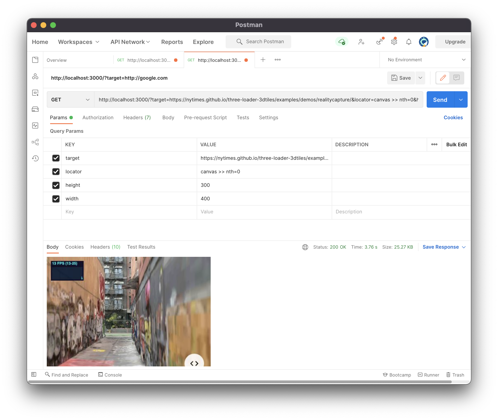
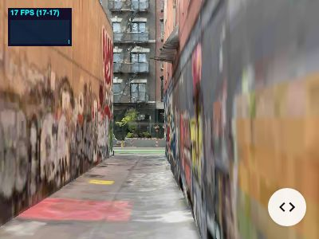

# playwright-render-server

A NodeJS Playwright server that serves web pages rendered to JPEG.

This even allows to serve WebGL rendered content to JPEG for example.

## Client usage

Example:

- To render this page: `https://nytimes.github.io/three-loader-3dtiles/examples/demos/realitycapture/`
- And render only this element of the page: `canvas >> nth=0`
- With a 400x300 resolution

Perform a GET on the server with the following parameters:

`http://localhost:3000/?target=https://nytimes.github.io/three-loader-3dtiles/examples/demos/realitycapture/&locator=canvas >> nth=0&height=300&width=400`

Example with Postman:



Example with Curl:

```bash
curl --location --request GET 'http://localhost:3000/?locator=canvas+>>+nth=0&target=https://nytimes.github.io/three-loader-3dtiles/examples/demos/realitycapture/&height=300&width=400' --output example.jpeg
```



## Server usage

```bash
npm install
npx playwright install
npm run dev
```
